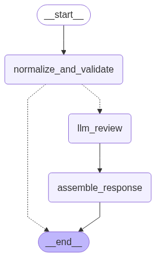

# Configuration Validator with AI Review (Moon Active assignment)



A small Python service that validates a game level configuration with two stages:
- Schema validation using Pydantic (fast, deterministic)
- AI review using an LLM (OpenAI by default) guided by editable difficulty heuristics (YAML)

It exposes a REST endpoint via FastAPI and also includes a tiny CLI runner.

## What it does

Given a JSON like:

```json
{
  "level": 12,
  "time_limit": 60,
  "reward": 5000,
  "difficulty": "easy"
}
```

The service will:
1) Validate the schema (types, required fields, ranges)
2) Ask an LLM to review the config against heuristics (defined in `graph/config/heuristics.yaml`)
3) Return a structured response with `schema_validation` and `llm_feedback`

If schema validation fails, the LLM step is skipped and you only get validation errors.

---

## Tech stack
- Python 3.10+ (tested with 3.13)
- FastAPI + Uvicorn (HTTP API)
- Pydantic (schema validation)
- LangGraph (simple linear graph for the flow)
- LangChain + OpenAI (LLM integration; Anthropic example included and easy to switch)
- PyYAML (editable heuristics)
- python-dotenv (loads `.env`)

---

## Setup

### 1) Clone and create a virtual environment

```bat
python -m venv .venv
.venv\Scripts\activate
python -m pip install --upgrade pip
python -m pip install -r requirements.txt
```

### 2) Configure your API key
Create a file named `.env` in the project root with your key(s):

```
# OpenAI (default path in code)
OPENAI_API_KEY=sk-...
OPENAI_MODEL=gpt-4o-mini

# Optional: Uncomment the Anthropic client in graph/chains/llm_review.py to use this
# ANTHROPIC_API_KEY=... 
```

The app calls `load_dotenv()` so environment variables from `.env` are picked up automatically.

---

## Run with Docker

You can use the published image to run the API without installing Python locally.

Windows cmd example (omit secrets; use placeholders or an env file):

```bat
docker run -p 8000:8000 ^
  -e OPENAI_API_KEY=YOUR_OPENAI_API_KEY ^
  -e OPENAI_MODEL=gpt-4o-mini ^
  -it docker.io/talhalaf/moonactive-home-assignment:latest
```

Optionally load variables from a local `.env` file instead of inlining keys:

```bat
docker run -p 8000:8000 ^
  --env-file .env ^
  -it docker.io/talhalaf/moonactive-home-assignment:latest
```

Open an interactive shell in the container (useful for debugging):

```bat
docker run -p 8000:8000 ^
  --entrypoint sh ^
  -it docker.io/talhalaf/moonactive-home-assignment:latest
```

Notes:
- The image’s entrypoint starts the FastAPI server on port 8000.
- Avoid committing or pasting real API keys in public places; prefer `--env-file`.

---

## Run the API server

```bat
python -m uvicorn server:app --reload --host 127.0.0.1 --port 8000
```

- Health check: http://127.0.0.1:8000/
- Interactive docs (Swagger): http://127.0.0.1:8000/docs

### Example request
Use curl from Windows cmd:

```bat
curl -X POST "http://127.0.0.1:8000/validate" ^
  -H "Content-Type: application/json" ^
  -d "{\"level\":12,\"time_limit\":60,\"reward\":5000,\"difficulty\":\"easy\"}"
```

Typical response shape:

```json
{
  "input_config": { "level": 12, "time_limit": 60, "reward": 5000, "difficulty": "easy" },
  "schema_validation": { "valid": true, "errors": [] },
  "llm_feedback": {
    "analysis": "...",
    "suggested_actions": ["...", "..."]
  }
}
```

If the schema is invalid you’ll get something like:

```json
{
  "schema_validation": {
    "valid": false,
    "errors": ["time_limit: Input should be greater than 0"]
  }
}
```

---

## Run the CLI demo (no server)
A tiny script that builds the same graph and prints the result:

```bat
python main.py
```

Edit the sample payload in `main.py` to try different values.

---

## Configuration heuristics
- File: `graph/config/heuristics.yaml`
- Example (defaults in repo):

```yaml
version: 1
difficulties:
  easy:   { reward: [100, 500],  time: { min: 30, max: null } }
  medium: { reward: [500, 2000], time: { min: 20, max: 60 } }
  hard:   { reward: [2000, 5000], time: { min: 10, max: 30 } }
```

These guidelines are embedded into the LLM prompt. Tweak ranges/times here without touching code.

---

## Switching LLM providers/models
- Default: OpenAI `gpt-4o-mini` (see `graph/chains/llm_review.py`)
- To change the model set env var `OPENAI_MODEL` (e.g., `gpt-4o`, `gpt-4o-mini`, `gpt-4.1-mini`) in your `.env`.
- To try Anthropic:
  - Uncomment the `ChatAnthropic` block in `graph/chains/llm_review.py`
  - Set `ANTHROPIC_API_KEY` in `.env`

The chain uses LangChain’s `with_structured_output(LLMFeedback)` to enforce a strict JSON schema for the AI response.

---

## API
- POST `/validate` — Body is the level configuration. Pydantic model `LevelConfig`:
  - `level` (int, >= 1)
  - `difficulty` ("easy" | "medium" | "hard")
  - `reward` (int, >= 0)
  - `time_limit` (int, > 0)

Response fields:
- `schema_validation`: `{ valid: boolean, errors: string[] }`
- `llm_feedback`: `{ analysis: string, suggested_actions: string[] }`
- `input_config` is echoed back for convenience

---

## Project structure
```
.
├─ main.py                      # CLI demo
├─ server.py                    # FastAPI app (POST /validate)
├─ requirements.txt
├─ graph/
│  ├─ graph.py                  # LangGraph: normalize -> llm_review -> assemble
│  ├─ state.py                  # TypedDict state schemas
│  ├─ models.py                 # Pydantic models and response shapes
│  ├─ consts.py                 # Node names
│  ├─ chains/llm_review.py      # LLM chain + prompts
│  ├─ nodes/                    # Graph nodes
│  ├─ prompts/                  # System/user prompt texts
│  └─ config/heuristics.yaml    # Editable balancing guidelines
```

---

## Notes and trade‑offs
- If validation fails, the graph stops before the LLM step (fast feedback, no spend)
- Heuristics are loaded once at process start and injected into the prompt
- Errors from the LLM step are caught and turned into a stubbed feedback message so the API still responds

---

## Troubleshooting
- 401/invalid API key: ensure `.env` has `OPENAI_API_KEY` and you restarted the process
- SSL/Proxy issues on Windows: try `python -m pip install --upgrade certifi` and/or set HTTP(S)_PROXY if needed
- Import errors: confirm your venv is active (`.venv\\Scripts\\activate`) and `pip install -r requirements.txt` succeeded

---

## License
For interview/demo use only; not licensed for production.
